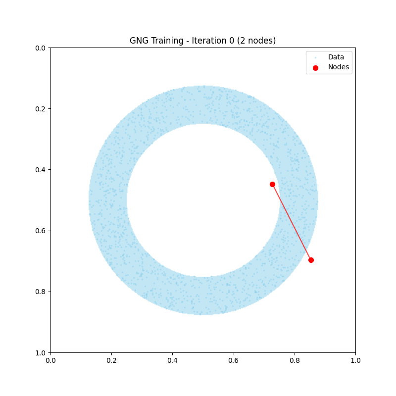
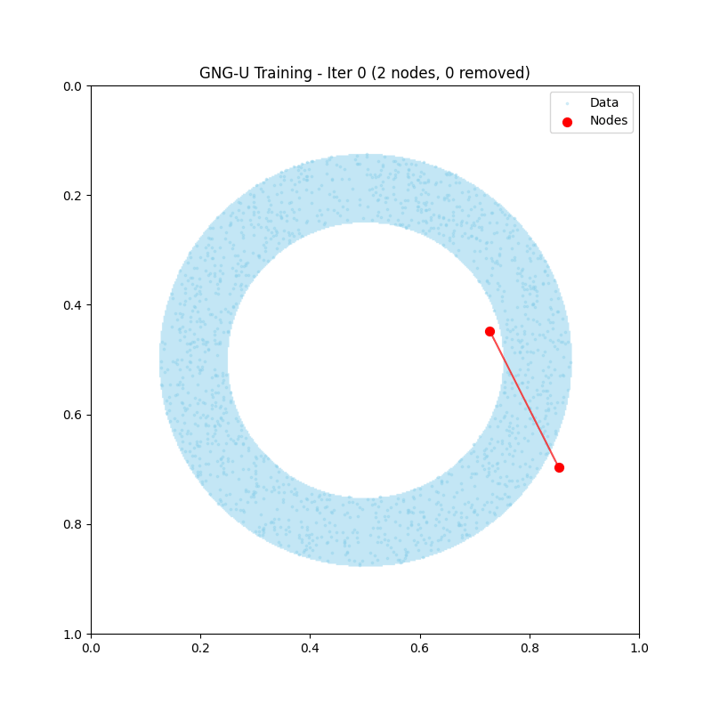
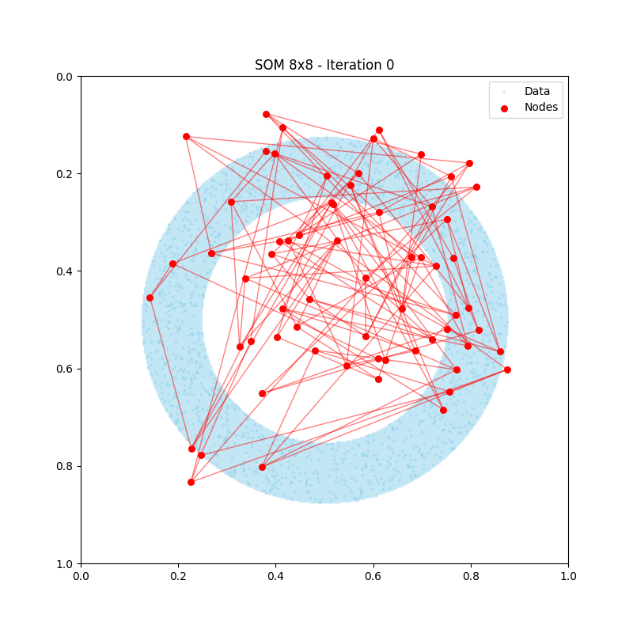
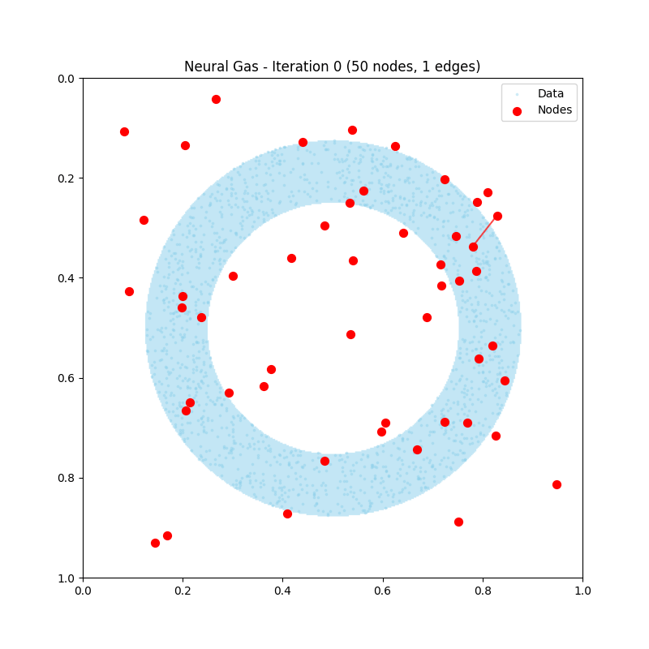
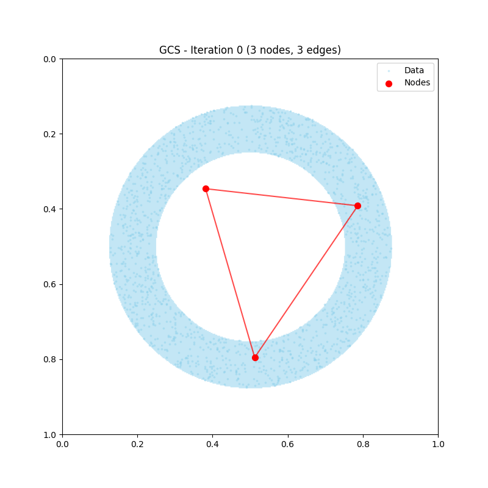

# GNG Collection

Growing Neural Gas (GNG) およびその関連アルゴリズムのコレクションリポジトリです。
各アルゴリズムのリファクタリング、2D/3Dデータへの適用テスト、新しいアイデアの実験を行います。

## 可視化サンプル

### GNG (Growing Neural Gas)

動的にノードを追加してトポロジーを学習。

| シングルリング | トラッキング |
|:-------------:|:-----------:|
|  |  |

### GNG-U (GNG with Utility)

非定常分布に対応。不要なノードをユーティリティ基準で除去。

| シングルリング | トラッキング |
|:-------------:|:-----------:|
|  |  |

### SOM (Self-Organizing Map)

固定グリッド構造でトポロジーを保存。

| シングルリング | トラッキング |
|:-------------:|:-----------:|
|  |  |

### Neural Gas

ランクベースの近傍関数で全ノードを更新。

| シングルリング | トラッキング |
|:-------------:|:-----------:|
|  |  |

### GCS (Growing Cell Structures)

三角メッシュ構造を維持しながら成長。

| シングルリング | トラッキング |
|:-------------:|:-----------:|
|  |  |

## 対応言語

- Python
- C++

## ディレクトリ構成

```
gng_collection/
├── algorithms/          # 各アルゴリズム実装
│   ├── _template/       # 新アルゴリズム用テンプレート
│   ├── gng/             # 標準GNG
│   ├── gng_u/           # GNG-U (Utility)
│   ├── som/             # Self-Organizing Map
│   ├── neural_gas/      # Neural Gas
│   └── gcs/             # Growing Cell Structures
├── experiments/         # 実験・アイデア試行
│   └── 2d_visualization/
│       ├── _templates/  # テストテンプレート
│       └── samples/     # 出力サンプル
├── data/                # サンプルデータ
├── references/          # 参照資料・元コード
│   ├── notes/           # アルゴリズムノート
│   └── original_code/   # リファレンス実装
└── python/              # Python共通設定・コア
```

## アルゴリズム一覧

| アルゴリズム | Python | C++ | 説明 |
|-------------|:------:|:---:|------|
| GNG         | ✓      | ✓   | Growing Neural Gas - 動的トポロジー学習 |
| GNG-U       | ✓      | -   | GNG with Utility - 非定常分布対応 |
| SOM         | ✓      | -   | Self-Organizing Map - 固定グリッド |
| Neural Gas  | ✓      | -   | ランクベース競合学習 |
| GCS         | ✓      | -   | Growing Cell Structures - メッシュ構造 |

## セットアップ

### Python

```bash
# 依存パッケージ
pip install numpy matplotlib pillow
```

### C++

```bash
cd experiments/2d_visualization/cpp
mkdir build && cd build
cmake ..
make
```

## 使い方

### GNG

```python
from algorithms.gng.python.model import GrowingNeuralGas, GNGParams

params = GNGParams(max_nodes=50, lambda_=100)
gng = GrowingNeuralGas(n_dim=2, params=params)
gng.train(X, n_iterations=5000)
nodes, edges = gng.get_graph()
```

### SOM

```python
from algorithms.som.python.model import SelfOrganizingMap, SOMParams

params = SOMParams(grid_height=10, grid_width=10)
som = SelfOrganizingMap(n_dim=2, params=params)
som.train(X, n_iterations=5000)
nodes, edges = som.get_graph()
```

### Neural Gas

```python
from algorithms.neural_gas.python.model import NeuralGas, NeuralGasParams

params = NeuralGasParams(n_nodes=50, use_chl=True)
ng = NeuralGas(n_dim=2, params=params)
ng.train(X, n_iterations=5000)
nodes, edges = ng.get_graph()
```

### GCS

```python
from algorithms.gcs.python.model import GrowingCellStructures, GCSParams

params = GCSParams(max_nodes=100, lambda_=100)
gcs = GrowingCellStructures(n_dim=2, params=params)
gcs.train(X, n_iterations=5000)
nodes, edges = gcs.get_graph()
```

## テストの実行

```bash
cd experiments/2d_visualization

# 各アルゴリズムのテスト
python test_gng_single_ring.py
python test_gngu_single_ring.py
python test_som_single_ring.py
python test_ng_single_ring.py
python test_gcs_single_ring.py

# トラッキングテスト
python test_gng_tracking.py
python test_gngu_tracking.py
python test_som_tracking.py
python test_ng_tracking.py
python test_gcs_tracking.py
```

## 新しいアルゴリズムの追加

1. `algorithms/_template/` をコピー
2. `experiments/2d_visualization/_templates/` のテストテンプレートを使用
3. テスト実行後、出力を `samples/[algorithm]/python/` に保存

詳細は [CLAUDE.md](CLAUDE.md) を参照してください。

## 参照元について

各アルゴリズムの詳細は `references/notes/` を参照してください。

- **GNG**: Fritzke, B. (1995). "A Growing Neural Gas Network Learns Topologies"
- **GNG-U**: Fritzke, B. (1997). "Some Competitive Learning Methods"
- **SOM**: Kohonen, T. (1982). "Self-organized formation of topologically correct feature maps"
- **Neural Gas**: Martinetz, T. and Schulten, K. (1991). "A Neural-Gas Network Learns Topologies"
- **GCS**: Fritzke, B. (1994). "Growing cell structures - a self-organizing network"

## License

MIT License
