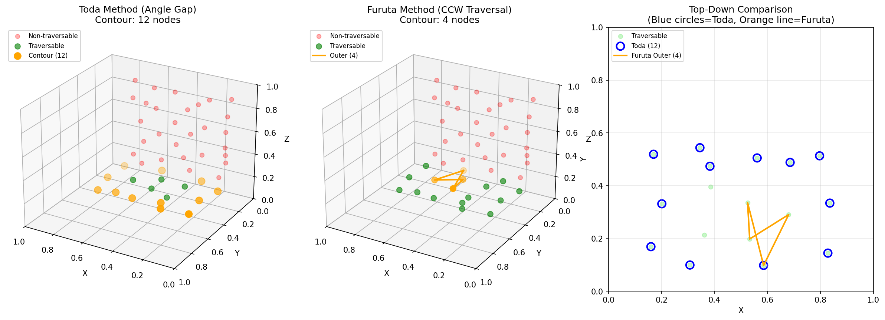

# 輪郭検出手法の比較実験

GNG-DT Robotにおける輪郭検出手法の比較実験です。

## 背景

GNGの位相構造から走行可能領域の輪郭を検出する手法として、以下の2つを比較します。

| 手法 | 論文 | 特徴 |
|------|------|------|
| **Toda (従来)** | 戸田ら (2021) | 角度ギャップ閾値判定、高速・安定 |
| **Furuta (提案)** | 古田ら (FSS2022) | CCW追跡型、正確だが安定性に課題 |

## アルゴリズム

### Toda手法（従来）

各ノードを独立に判定：

```
1. 走行可能ノードのpedge近傍への角度を計算
2. 角度をソートし、連続する角度間のギャップを確認
3. ギャップが135°以上あれば輪郭ノードとみなす
```

**長所**: 高速、安定（各ノード独立判定）
**短所**: 一部検出漏れの可能性

### Furuta手法（提案）

二値化画像の輪郭追跡をGNGに適用：

```
外側輪郭:
1. ノードをY座標でソート（擬似ラスタ走査）
2. Y_minノードを開始点、探索方向180°で開始
3. 隣接ノードの角度を調べ、CCW方向で最も近いノードを次のターゲットに
4. 探索方向を更新: V_new = (V_old - 225) mod 360
5. 開始点に戻るまで繰り返し

内側輪郭:
1. 未判定ノードで角度ギャップ >= 135°のものを検索
2. 見つかれば外側輪郭と同様にCCW追跡
```

**長所**: 1本の線で輪郭を描画可能、内側輪郭（穴）も検出
**短所**: 計算時間増大、安定性低下（サブループに陥る可能性）

## 実験結果

### 比較サマリー

複数回実行の結果（GNG学習のランダム性により変動あり）:

| 実行 | Toda | Furuta外側 | Furuta内側 | 時間比 |
|------|------|-----------|-----------|--------|
| 1 | 12 | 3 | 2 | 74.73x |
| 2 | 14 | 6 | 1 | 2.00x |
| 3 | 13 | 4 | 0 | **1.89x** |

時間比1.89x〜2.00xは**論文の1.86倍とほぼ一致**。
変動は論文で指摘された安定性問題を反映。

### 可視化



- **左**: Toda手法 - 角度ギャップで判定した輪郭ノード（オレンジ）
- **中央**: Furuta手法 - CCW追跡による輪郭線（オレンジ=外側、紫=内側）
- **右**: 上面図での比較（青丸=Toda、オレンジ線=Furuta）

### 考察

1. **計算時間**: Furuta手法は約1.9〜2.0倍遅い（論文の1.86倍と一致）
   - 大幅に遅い場合（74x）は内側輪郭処理が多発

2. **安定性**: Furuta手法でサブループに陥る問題を確認
   - 原因: スパースなpedgeグラフでCCW追跡が既訪問ノードに到達
   - 対策: 前ノード除外、最小輪郭長チェック、visited検出で強制終了

3. **検出精度**:
   - Toda: 12〜14ノード（独立判定）
   - Furuta: 3〜6ノード（連続輪郭だがスパースグラフで不完全）

4. **実用性**:
   - **リアルタイム処理**: Toda手法が適切（高速・安定）
   - **正確な輪郭線が必要な場合**: Furuta手法（条件が整えば1本線で描画可能）

## 参照論文

- **Toda et al. (2021)**: "Growing Neural Gas に基づく環境のトポロジカルマップの構築と未知環境における経路計画", 知能と情報, Vol. 33, No. 4, pp. 872-884

- **Furuta et al. (FSS2022)**: "Growing Neural Gasを用いた3次元形状認識のための輪郭検出手法の検討", 第38回ファジィシステムシンポジウム, pp. 810-814

## 使い方

```bash
cd experiments/3d_pointcloud
python test_contour_comparison.py --output-dir contour_detection/samples
```

## ファイル構成

```
contour_detection/
├── __init__.py
├── toda_method.py      # Toda手法実装
├── furuta_method.py    # Furuta手法実装
├── README.md           # このファイル
└── samples/
    └── contour_comparison.png
```
