# Utility Tracking Comparison Experiments

GNG-U, GNG-U2, AiS-GNGのutility機構による追従性能を比較する実験です。

## 実験概要

### 追従テスト
- 円軌道上を移動するリング状分布を追従
- 120フレーム（1周）
- 各フレームで50サンプルを生成・学習
- **評価指標**:
  - **Inside**: 真のデータ分布内にあるノード数（多いほど良い）
  - **Outside**: 分布外に残ってしまったノード数（少ないほど追従性が良い）

### 比較対象
| アルゴリズム | 距離計算 | 説明 |
|-------------|---------|------|
| GNG-U | Squared (‖x-w‖²) | Fritzke論文準拠、λ間隔でutilityチェック |
| GNG-U2 | Euclidean (‖x-w‖) | Toda論文準拠、κ間隔でutilityチェック |
| AiS-GNG | Euclidean (‖x-w‖) | GNG-U2 + Add-if-Silent ルール |

### 比較バリアント
公平な比較のため、距離計算を統一したバリアントを作成:
- **GNG-U Euclidean**: GNG-Uのユークリッド距離版
- **GNG-U2 Squared**: GNG-U2の二乗距離版
- **AiS-GNG Squared**: AiS-GNGの二乗距離版

---

## アルゴリズム間比較

### Squared Distance (k=1.3)

同じutility_k=1.3で3つのアルゴリズムを比較。

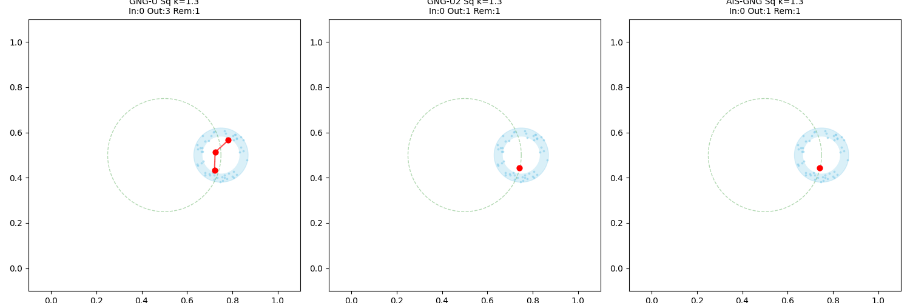

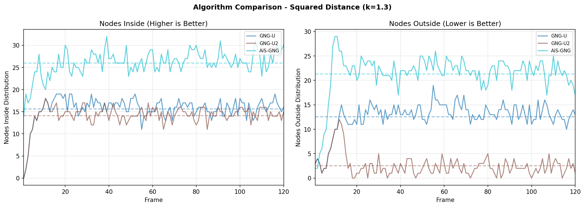

### Euclidean Distance (k=50)

同じutility_k=50で3つのアルゴリズムを比較。

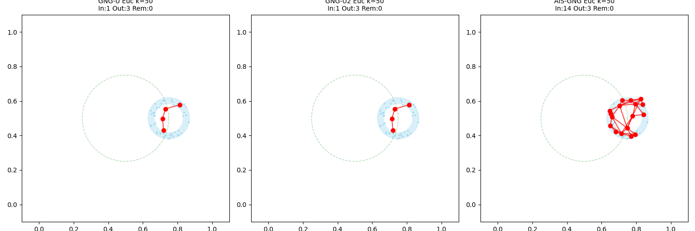

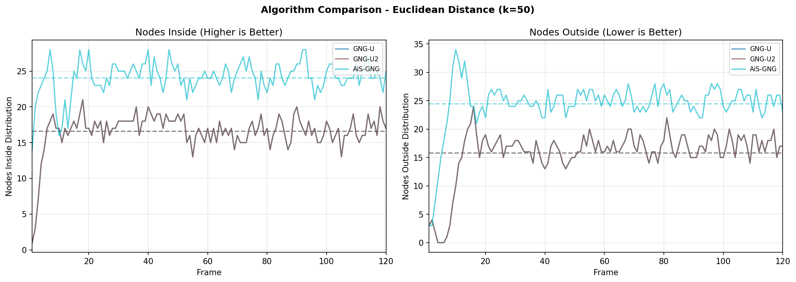

---

## GNG-U

### Squared Distance (オリジナル)

utility_k: 0.5, 1.3, 5.0, 20.0


### Euclidean Distance (バリアント)

utility_k: 20, 50, 100, 500

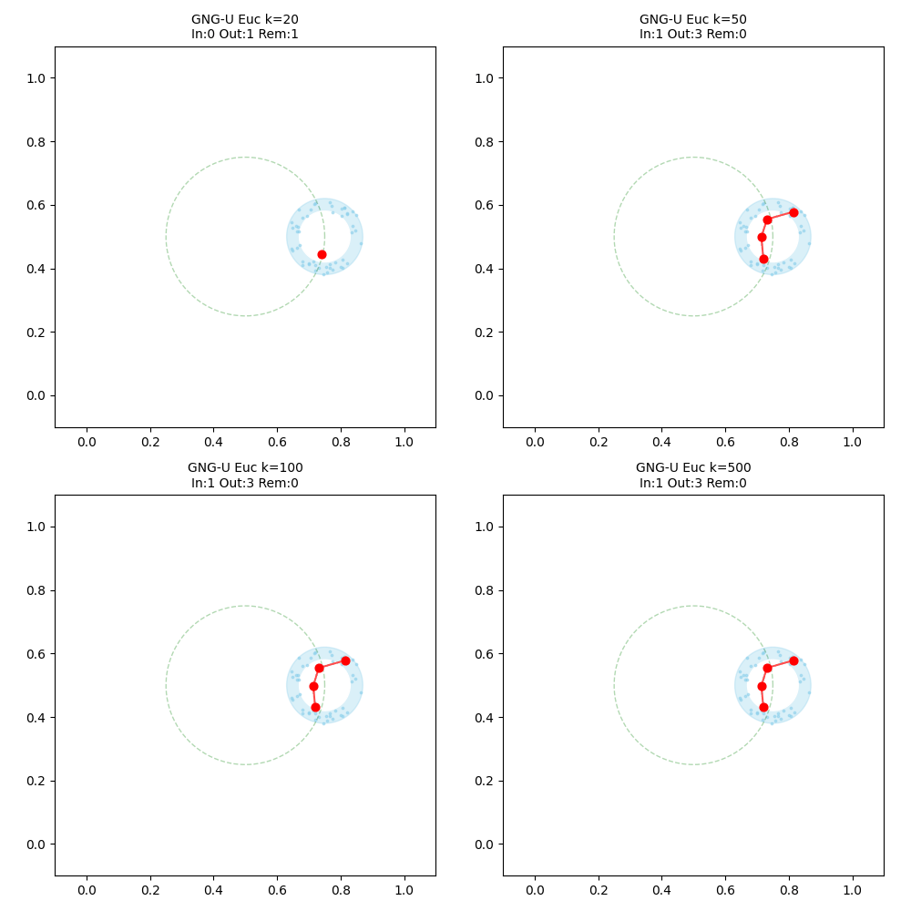

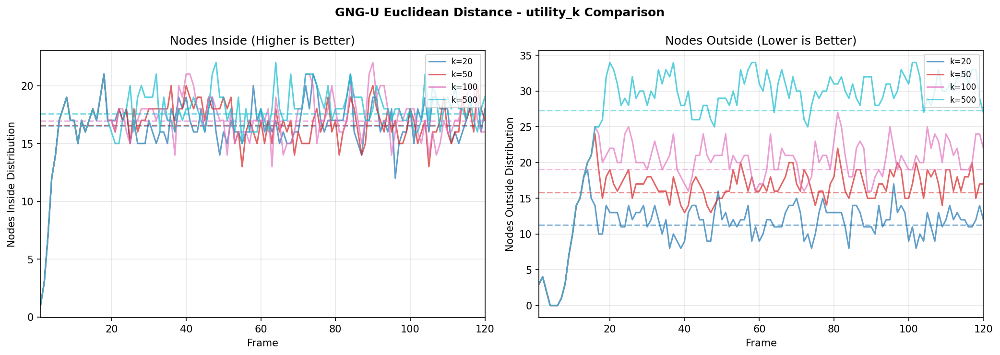

---

## GNG-U2

### Squared Distance (バリアント)

utility_k: 0.5, 1.3, 5.0, 20.0

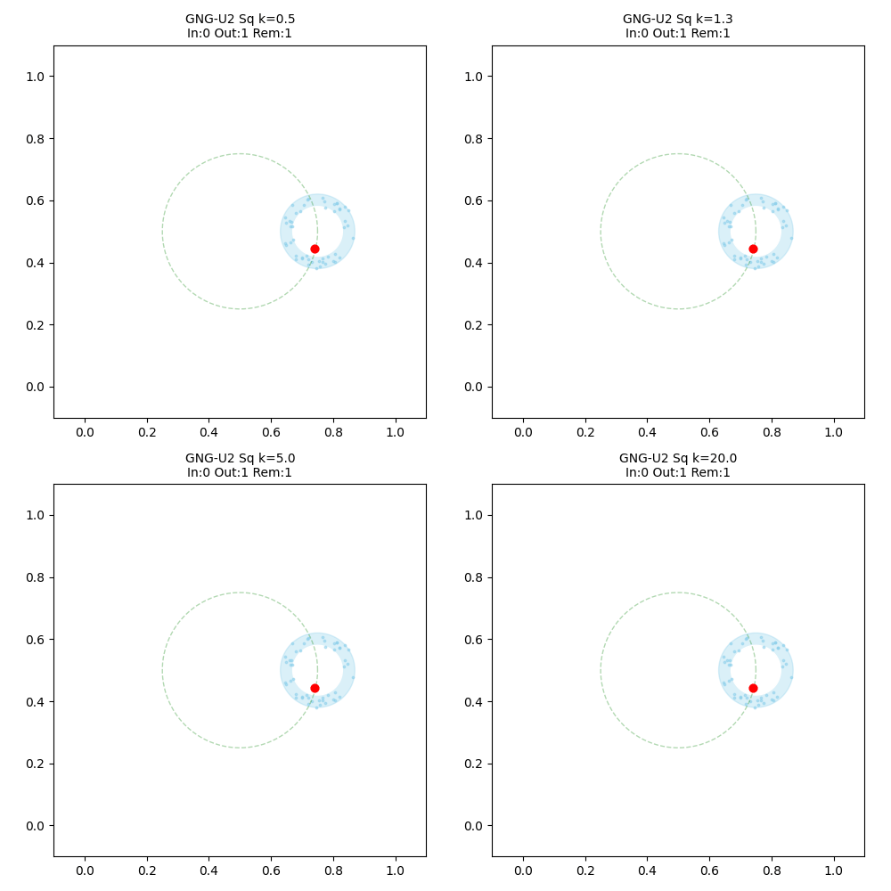

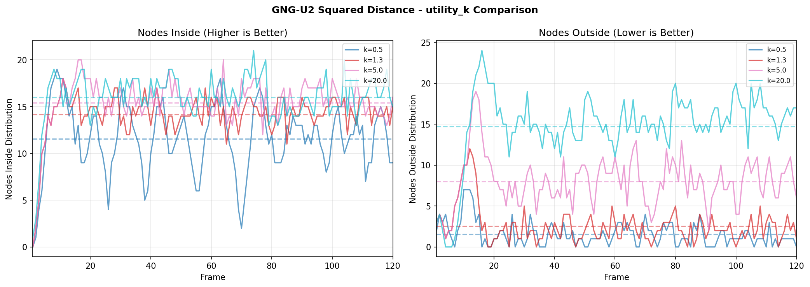

### Euclidean Distance (オリジナル)

utility_k: 20, 50, 100, 500

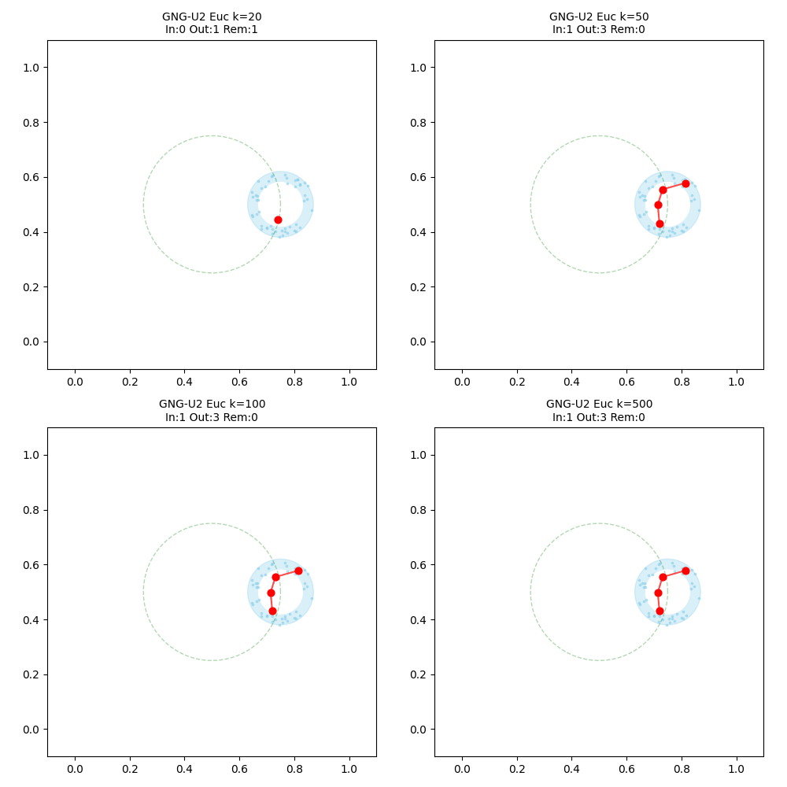


---

## AiS-GNG

### Squared Distance (バリアント)

utility_k: 0.5, 1.3, 5.0, 20.0

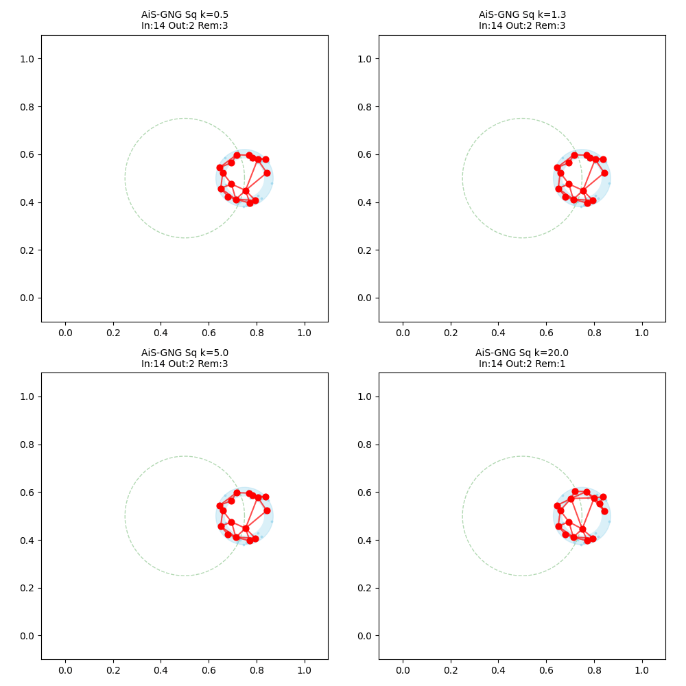

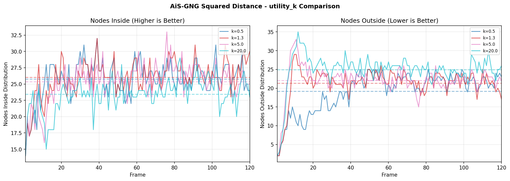

### Euclidean Distance (オリジナル)

utility_k: 20, 50, 100, 500

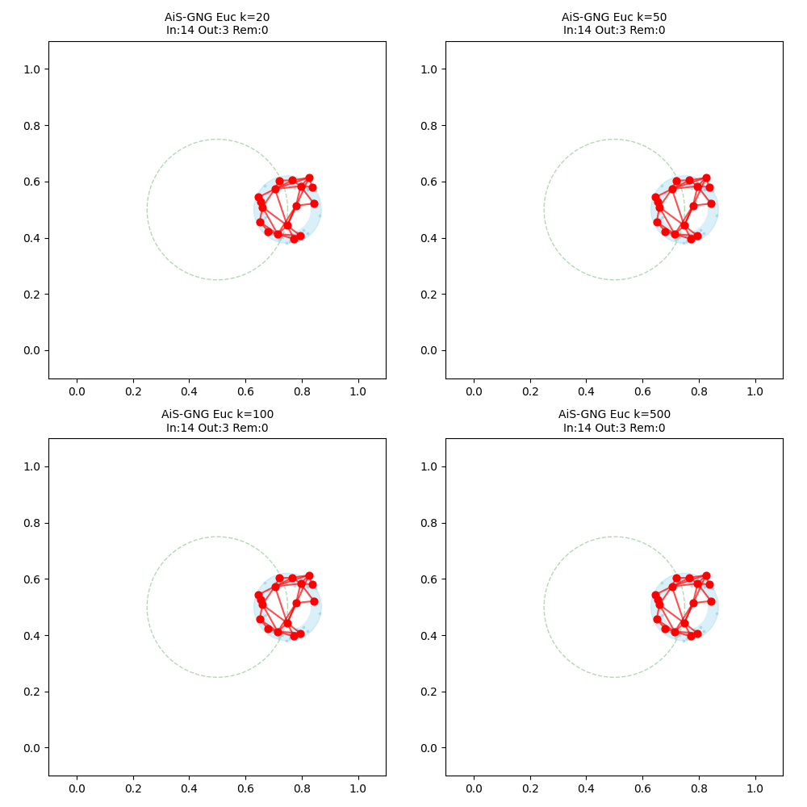

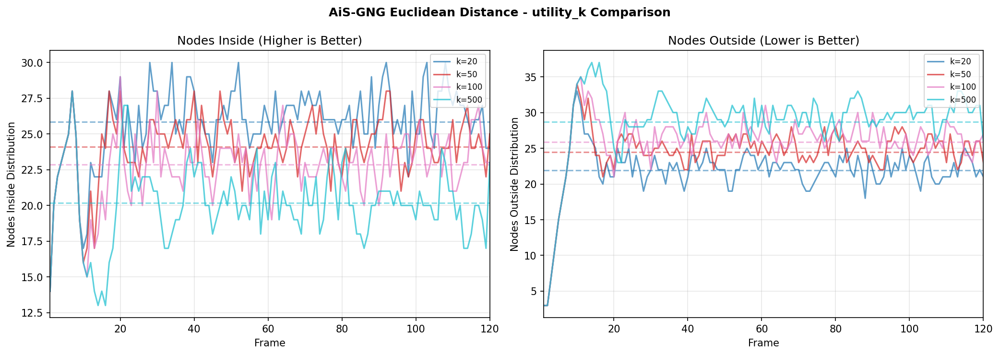

---

## 実験パラメータ

### 共通パラメータ
```python
max_nodes = 50
lambda_ = 20
eps_b = 0.15      # 勝者学習率
eps_n = 0.01      # 近傍学習率
alpha = 0.5
beta = 0.01       # 誤差減衰率
max_age = 30
```

### GNG-U2/AiS-GNG追加パラメータ
```python
chi = 0.01        # utility減衰率
kappa = 10        # utilityチェック間隔
```

### AiS-GNG Add-if-Silent パラメータ
```python
# Euclidean Distance
theta_ais_min = 0.03
theta_ais_max = 0.15

# Squared Distance
theta_ais_min_sq = 0.0009  # 0.03^2
theta_ais_max_sq = 0.0225  # 0.15^2
```

---

## 考察

### 距離計算の影響
- **Squared Distance**: utility_k=0.5〜5.0の範囲で良好な追従性
- **Euclidean Distance**: utility_k=20〜100の範囲で良好な追従性
- 距離の二乗により値のスケールが異なるため、最適なkも異なる

### アルゴリズム間の違い
1. **GNG-U**: λ間隔でのみutilityチェック → ノード削除が少ない傾向
2. **GNG-U2**: κ間隔でutilityチェック → より頻繁なノード削除
3. **AiS-GNG**: Add-if-Silentルールにより高密度領域に素早くノード追加

### 推奨設定
| 距離計算 | 推奨utility_k |
|---------|--------------|
| Squared | 1.3 (論文値) |
| Euclidean | 50〜100 |

---

## ディレクトリ構造

```
comparison/
├── models/
│   ├── __init__.py
│   ├── gngu_euclidean.py     # GNG-U (ユークリッド距離版)
│   ├── gngu2_squared.py      # GNG-U2 (二乗距離版)
│   └── aisgng_squared.py     # AiS-GNG (二乗距離版)
├── results/                   # 実験結果
│   ├── *_utility_k.gif       # アニメーション
│   ├── *_line_graph.png      # 折れ線グラフ
│   └── algorithm_comparison_*.gif  # アルゴリズム比較
├── generate_comparison_gifs.py   # GIF生成スクリプト
├── generate_line_graphs.py       # 折れ線グラフ生成スクリプト
├── utility_tracking_comparison.py  # 数値比較実験スクリプト
└── README.md
```

## スクリプト

```bash
# GIF生成
python generate_comparison_gifs.py

# 折れ線グラフ生成
python generate_line_graphs.py

# 数値比較実験
python utility_tracking_comparison.py
```
