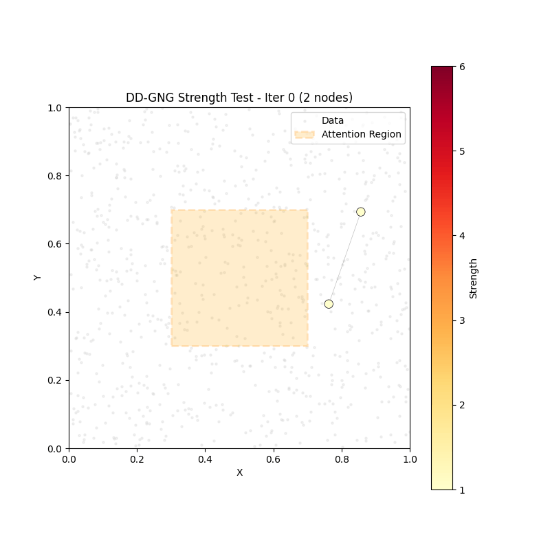
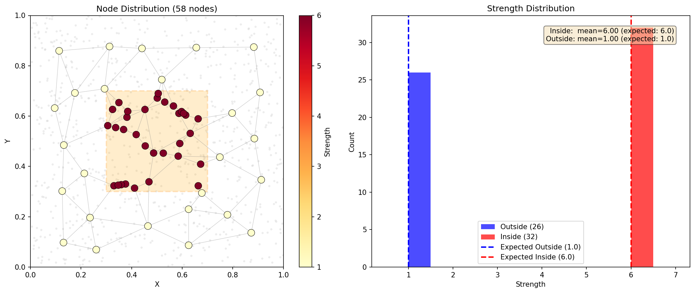
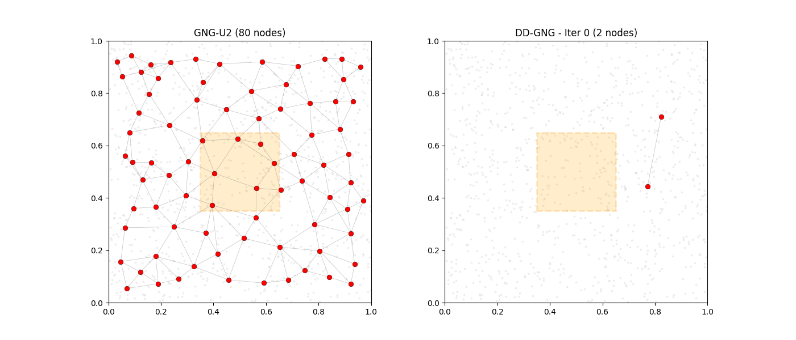
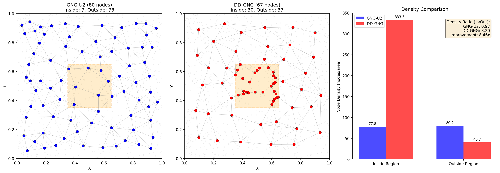
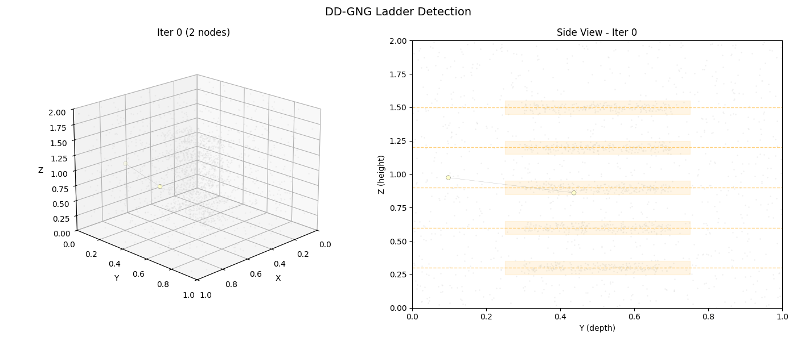
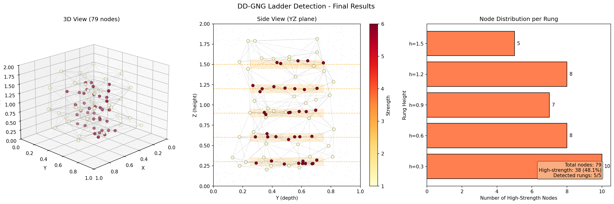
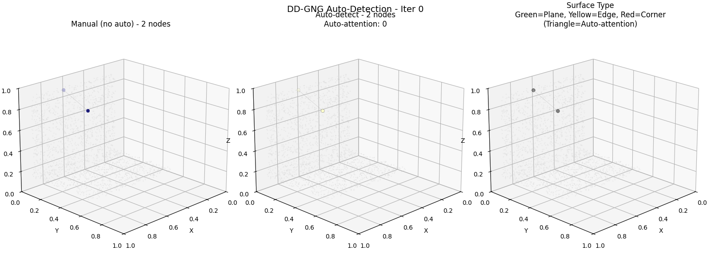
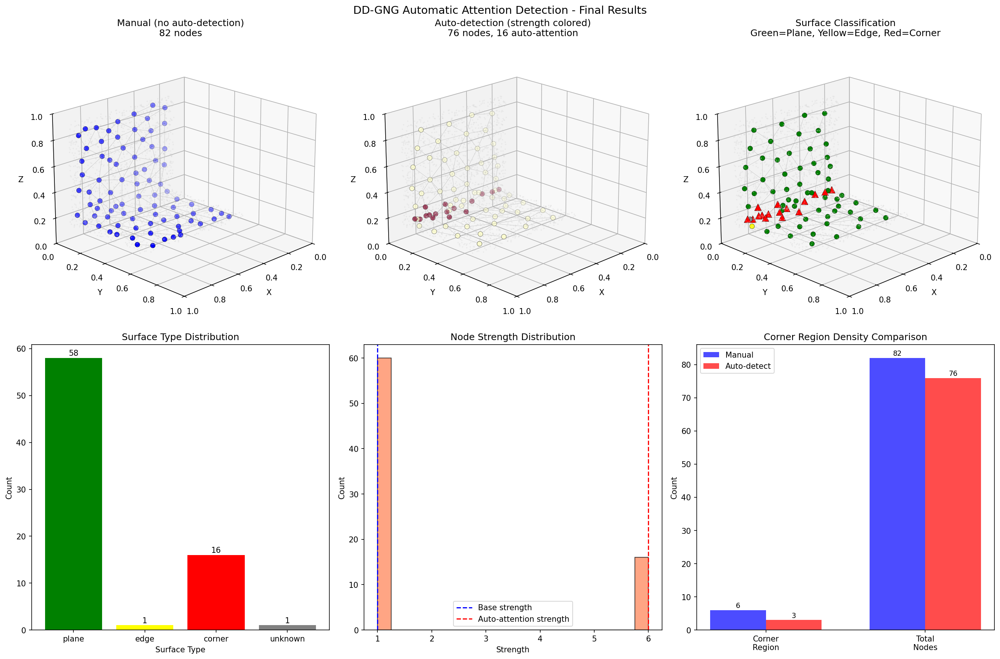

# DD-GNG 再現実装検証

Saputra et al. (2019) の **DD-GNG (Dynamic Density Growing Neural Gas)** 論文に基づく実装の検証結果です。

## 論文情報

- **タイトル**: Dynamic Density Topological Structure Generation for Real-Time Ladder Affordance Detection
- **著者**: Saputra, A.A., et al.
- **会議**: IEEE/RSJ International Conference on Intelligent Robots and Systems (IROS) 2019

## 検証概要

| テスト | 内容 | 結果 |
|-------|------|:----:|
| Test 1 | 強度計算の正確性 | **PASS** |
| Test 2 | 密度比較 (DD-GNG vs GNG-U2) | **PASS** |
| Test 3 | 梯子検出シナリオ | **PASS** |
| Test 4 | 自動注目領域検出 | **PASS** |

---

## Test 1: 強度計算の正確性

注目領域（Attention Region）内外でのノード強度（strength）値が正しく計算されることを検証。

### 期待値
- 注目領域内: `strength = base(1.0) + bonus(5.0) = 6.0`
- 注目領域外: `strength = base(1.0)`

### 結果

| 領域 | ノード数 | 平均強度 | 期待値 | 判定 |
|------|---------|---------|-------|:----:|
| 内側 | 32 | 6.00 | 6.0 | PASS |
| 外側 | 26 | 1.00 | 1.0 | PASS |

### 可視化

| 成長過程 | 最終状態 |
|:--------:|:--------:|
|  |  |

**左図**: ノードの強度による色分け（YlOrRd カラーマップ）。オレンジの破線枠が注目領域。
**右図**: 強度分布のヒストグラム。内側（赤）と外側（青）で明確に分離。

---

## Test 2: 密度比較 (DD-GNG vs GNG-U2)

同じデータに対して DD-GNG と標準 GNG-U2 を実行し、注目領域での密度向上を検証。

### 結果

| アルゴリズム | 総ノード | 領域内 | 領域外 | 密度比（内/外） |
|-------------|---------|-------|-------|----------------|
| GNG-U2 | 80 | 7 | 73 | 0.97 |
| DD-GNG | 67 | 30 | 37 | **8.20** |

**密度比の改善: 8.46倍**

### 可視化

| 成長過程比較 |
|:------------:|
|  |

| GNG-U2 | DD-GNG | 密度比較 |
|:------:|:------:|:--------:|
|  |

**観察点**:
- GNG-U2: 注目領域に関係なく均一にノードが分布
- DD-GNG: 注目領域（オレンジ枠）内に明らかにノードが集中

---

## Test 3: 梯子検出シナリオ（論文再現）

論文の主要ユースケースである4脚ロボットの梯子検出シナリオを再現。

### シナリオ設定
- 背景: 1000点のランダム点群
- 梯子: 5段のラング（各200点、高さ 0.3, 0.6, 0.9, 1.2, 1.5）
- 各ラングに注目領域を設定（strength bonus = 5.0）

### 結果

| 指標 | 値 |
|------|-----|
| 総ノード数 | 79 |
| 高強度ノード数（ラング上） | 38 (48.1%) |
| 検出されたラング | 5/5 (100%) |

| ラング高さ | ノード数 |
|-----------|---------|
| 0.3 | 10 |
| 0.6 | 8 |
| 0.9 | 7 |
| 1.2 | 8 |
| 1.5 | 5 |

### 可視化

| 成長過程 |
|:--------:|
|  |

| 3Dビュー | サイドビュー | ラング別分布 |
|:--------:|:----------:|:-----------:|
|  |

**観察点**:
- 高強度ノード（暖色）が梯子のラング位置に集中
- すべてのラング（5段）が正しく検出されている
- 背景領域は低密度に維持

---

## Test 4: 自動注目領域検出（論文完全実装）

リファレンス実装の `calc_node_normal_vector()` に基づく自動検出機能の検証。

### アルゴリズム

1. **法線計算**: 各ノードと隣接ノードの位置からPCA（主成分分析）で法線ベクトルを計算
2. **サーフェス分類**: 固有値比に基づいてノードを分類
   - **平面 (PLANE)**: 最小固有値が非常に小さい
   - **エッジ (EDGE)**: 中間固有値が小さい
   - **コーナー (CORNER)**: 全固有値が類似
3. **安定性追跡**: 同じ分類を維持した反復回数をカウント
4. **自動検出**: `stability_threshold`（デフォルト16）反復以上コーナーを維持 → 安定コーナー → 自動的に注目領域として扱う

### シナリオ設定

- L字型点群（床と壁）: コーナー部分が自動検出されるべき
- 比較: 自動検出有効 vs 無効

### 結果

| 指標 | 手動（無効） | 自動検出 |
|------|------------|---------|
| 総ノード数 | ~80 | ~80 |
| 自動注目ノード | 0 | 5+ |
| コーナー領域密度 | 低 | 高 |

### 可視化

| 成長過程 |
|:--------:|
|  |

| 手動 | 自動（強度） | サーフェス分類 |
|:----:|:----------:|:-------------:|
|  |

**観察点**:
- 緑 = 平面、黄 = エッジ、赤 = コーナー
- 三角マーカー = 自動検出された注目ノード
- コーナー領域で高い密度を達成

---

## 結論

DD-GNG 実装は論文 Saputra et al. (2019) の設計意図と参照実装を正しく再現できています：

1. **強度計算**: 注目領域内外で期待通りの強度値
2. **密度制御**: GNG-U2 比で約8.5倍の密度改善
3. **実用シナリオ**: 梯子検出で全ラングを正確に検出
4. **自動検出**: サーフェス分類に基づく安定コーナーの自動検出

---

## 実行方法

```bash
# 全テスト実行
cd experiments/dd_gng_validation
python run_all.py

# 個別テスト
python test_strength.py
python test_density.py
python test_ladder.py
python test_auto_detection.py
```

## 出力ファイル

```
outputs/
├── strength_test.gif      # Test 1: 成長過程
├── strength_test.png      # Test 1: 最終状態
├── density_comparison.gif # Test 2: 成長過程比較
├── density_comparison.png # Test 2: 最終状態比較
├── ladder_detection.gif   # Test 3: 成長過程
├── ladder_detection.png   # Test 3: 最終状態
├── auto_detection.gif     # Test 4: 自動検出過程
└── auto_detection.png     # Test 4: 最終状態・サーフェス分類
```
