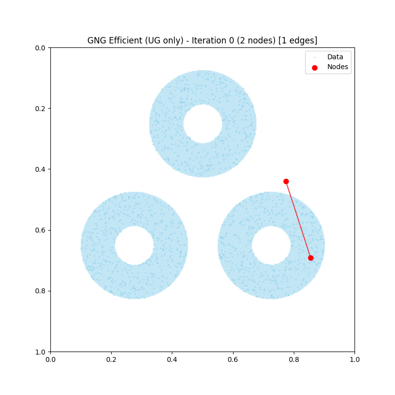
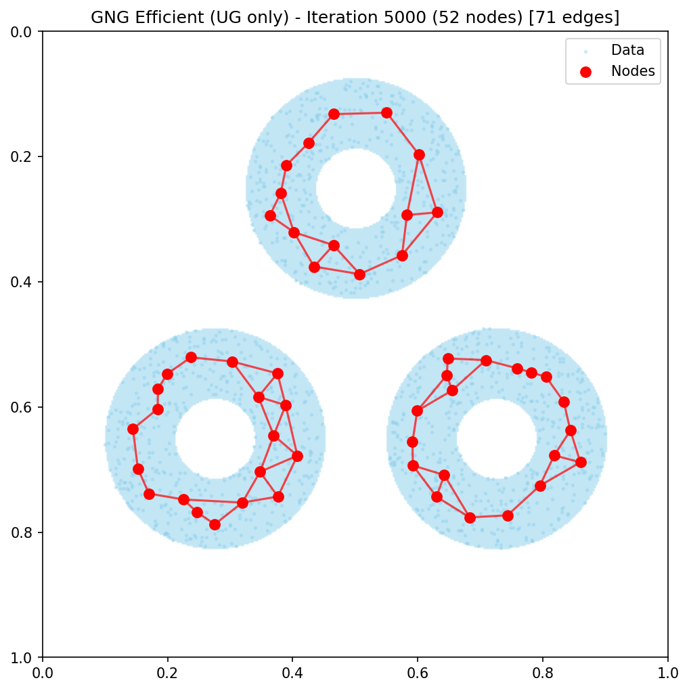

# GNG Efficient 実験結果

Fišer et al. (2013) "Growing Neural Gas Efficiently" の再現実装の実験結果です。

## 概要

GNG Efficient は、標準GNGアルゴリズムに2つの最適化を適用した高速版です：

1. **Uniform Grid**: 空間をセルに分割し、最近傍探索をO(1)平均で実行
2. **Lazy Error Evaluation**: エラー減衰を遅延計算し、毎ステップO(n)の操作を回避

## 実験パラメータ

### 論文デフォルト (Table 2)

| パラメータ | 値 | 説明 |
|-----------|-----|------|
| λ (lambda) | 200 | ノード挿入間隔 |
| ε_b | 0.05 | 勝者学習率 |
| ε_n | 0.0006 | 近傍学習率 |
| β | 0.9995 | エラー減衰率（毎ステップ） |
| α | 0.95 | ノード挿入時のエラー減衰率 |
| A_max | 200 | 最大エッジ年齢 |
| h_t | 0.1 | グリッド密度閾値 |
| h_ρ | 1.5 | グリッド拡張係数 |

---

## 2D実験

### Triple Ring テスト（静的分布）- 論文版 (UG + Lazy Error)

3つの同心円リングからサンプリングした点群にGNG Efficientを適用。
論文のパラメータ（Table 2）を使用。

**パラメータ**:
- max_nodes: 100
- lambda: 200 (論文デフォルト)
- beta: 0.9995 (論文デフォルト、減衰係数)
- use_lazy_error: True

| 成長過程 | 最終状態 |
|:--------:|:--------:|
|  |  |

**結果**: 51ノード、64エッジで3つのリング構造を学習。

---

### Triple Ring テスト（静的分布）- UG only（推奨）

Uniform Gridのみを使用し、標準GNGと同等の結果を得る設定。

**パラメータ**:
- max_nodes: 100
- lambda: 100 (標準GNGデフォルト)
- beta: 0.005 (標準GNGデフォルト、減衰率)
- use_lazy_error: False

| 成長過程 | 最終状態 |
|:--------:|:--------:|
|  |  |

**結果**: 52ノード、71エッジで3つのリング構造を学習。標準GNGと同等の挙動。

---

### Tracking テスト（動的分布）

移動するリング分布をオンライン学習で追跡。

**パラメータ**:
- max_nodes: 50
- lambda: 20
- total_frames: 120
- samples_per_frame: 50

| 追跡アニメーション |
|:------------------:|
|  |

**結果**: 移動する分布に適応し、リング構造を維持しながら追跡。

---

## 3D実験

### Floor & Wall テスト（L字型3D表面）

床面（XZ平面）と壁面（XY平面）が直角に接続したL字型形状での3Dトポロジー学習。

**パラメータ**:
- max_nodes: 150
- lambda: 100
- n_iterations: 8000

| 成長過程 | 最終状態 |
|:--------:|:--------:|
|  |  |

**結果**: 81ノード、163エッジで床と壁の両面を覆うトポロジーを学習。

---

## 最適化の効果（ベンチマーク実験）

### 本リポジトリでの実測結果

2D一様分布（50,000点）に対してPythonで実測した結果：

| max_nodes | Standard GNG | UG only | 高速化 | エッジ数 (Std/UG) |
|-----------|-------------|---------|--------|-------------------|
| 500 | 45.4s | 10.3s | **4.4x** | 1264 / 1264 ✓ |
| 1000 | 177.0s | 20.8s | **8.5x** | 2631 / 2604 ✓ |

**観察結果**:
- **Uniform Grid (UG)**: ノード数が増えるほど効果大。1000ノードで約8.5倍高速化
- **Lazy Error**: 結果のエッジ数が異なる（下記「Lazy Errorの制限」参照）

### Lazy Errorの制限（重要）

論文のLazy Error公式は、標準GNGのエラー処理と**完全に等価ではない**ことが判明しました。

**数学的差異**:
```
標準GNG:     E = E × β^λ + dist_sq × β^(λ-s-1)
論文Lazy:    E = E × β^(λ-s) + dist_sq
```

- 既存エラーへの減衰: β^λ vs β^(λ-s) → Lazyは減衰が少ない
- 新規エラーへの減衰: β^(λ-s-1) vs 1 → Lazyは減衰なし

**影響**: エラー蓄積が増加し、ノード選択順序とトポロジーが標準GNGと異なる結果になる。

**推奨設定**:
```python
# 標準GNGと同等の結果が必要な場合（推奨）
params = GNGEfficientParams(
    use_uniform_grid=True,   # 4-8倍高速化
    use_lazy_error=False,    # 結果を保持
)

# 論文完全再現が必要な場合
params = GNGEfficientParams(
    use_uniform_grid=True,
    use_lazy_error=True,     # 最大高速化（結果は異なる）
)
```

詳細は `references/notes/gng_efficient_fiser2013.md` セクション8.5を参照。

### ベンチマークの実行

```bash
cd experiments/benchmarks
python benchmark_gng_efficient.py --max-nodes 500 1000 --n-samples 50000
```

### 論文の報告値（参考）

論文によると、50,000ノードでの性能比較（C++実装）：

| バリアント | 時間 (秒) | 高速化率 |
|-----------|----------|---------|
| Original (線形探索 + 通常エラー) | 8,294 | 1x |
| UG (Uniform Grid のみ) | 4,814 | 1.7x |
| Err (遅延エラー のみ) | 3,418 | 2.4x |
| **UG+Err (両方)** | **10.67** | **777x** |

**注意**: 論文の数百倍の高速化は、オリジナル実装がO(n)の単純な線形探索を使用していたことによる。
本リポジトリの標準GNGは既にハッシュベースのエッジ管理を使用しているため、差は小さい。

## 参考文献

- Fišer, D., Faigl, J., & Kulich, M. (2013). "Growing Neural Gas Efficiently". Neurocomputing.
- Fritzke, B. (1995). "A Growing Neural Gas Network Learns Topologies". NIPS.

## ファイル構成

```
experiments/gng_efficient/
├── README.md           # このファイル
├── 2d/
│   ├── triple_ring_final.png         # 論文版（UG+Lazy）
│   ├── triple_ring_growth.gif
│   ├── triple_ring_ug_only_final.png # UG only（推奨）
│   ├── triple_ring_ug_only_growth.gif
│   └── tracking.gif
└── 3d/
    ├── floor_wall_final.png
    └── floor_wall_growth.gif
```

## 実行方法

```bash
# 2D Triple Ring (論文版: UG + Lazy Error)
cd experiments/2d_visualization
python test_gng_efficient_triple_ring.py

# 2D Triple Ring (UG only: 標準GNG同等、推奨)
python test_gng_efficient_ug_only_triple_ring.py

# 2D Tracking
python test_gng_efficient_tracking.py

# 3D Floor & Wall
cd experiments/3d_pointcloud
python test_gng_efficient_floor_wall.py
```
