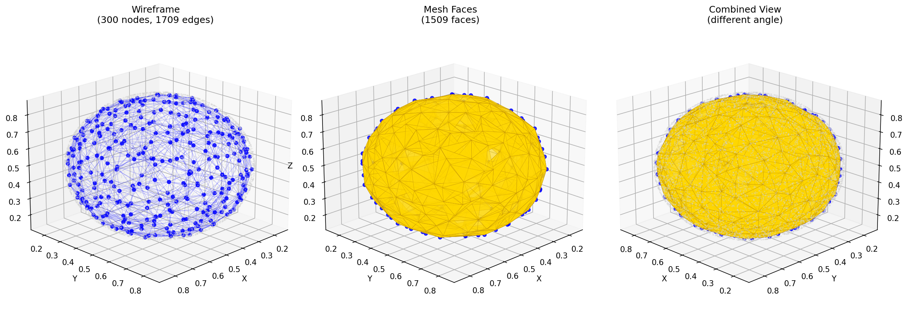
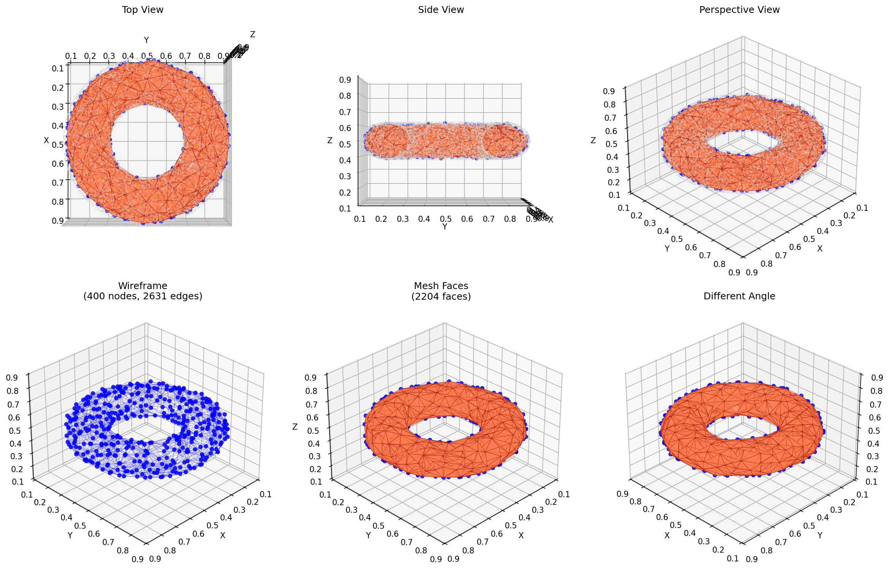
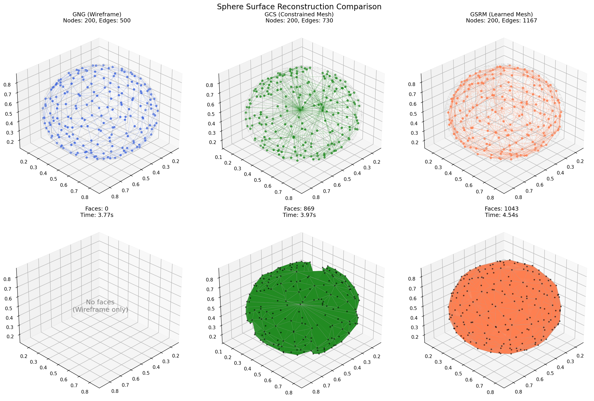
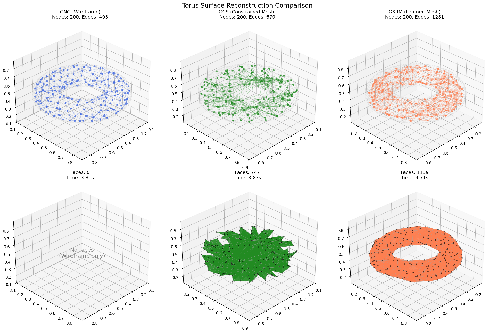
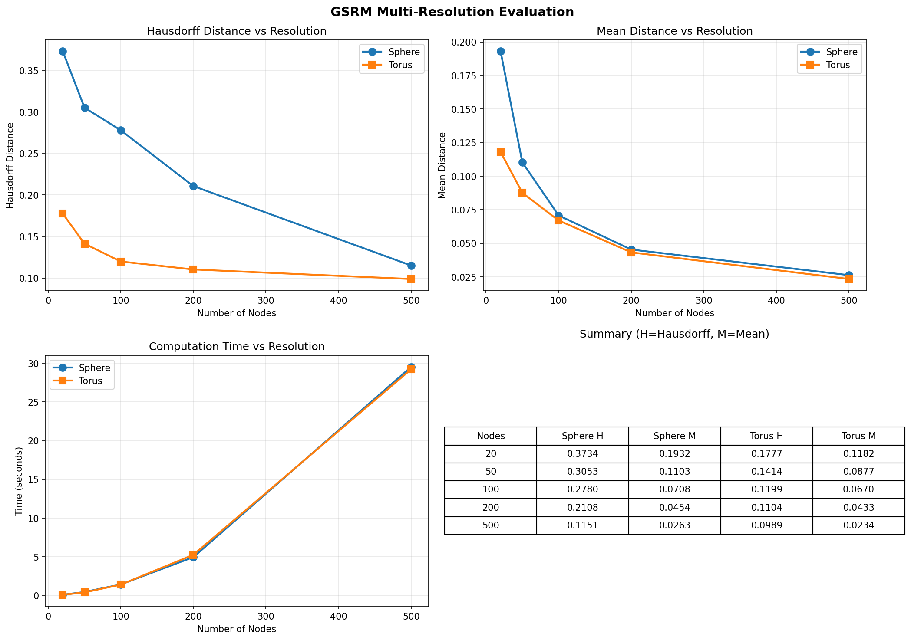
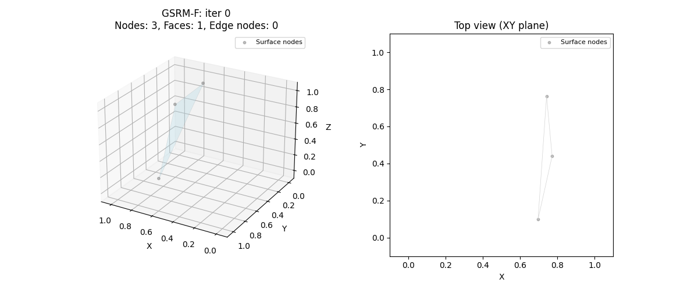
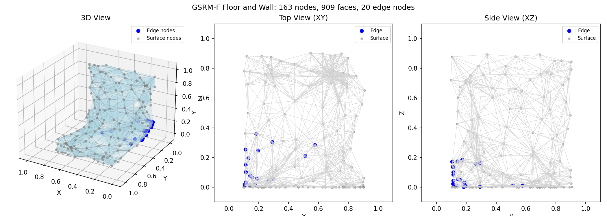
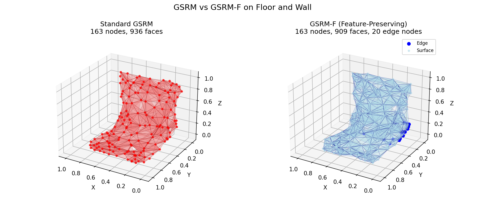

# GSRM (Growing Self-Reconstruction Meshes) 再現実装

## 実験結果

### 球体 (Sphere) 表面再構成

| 成長過程 | 最終状態 |
|:--------:|:--------:|
|  |  |

**パラメータ**: max_nodes=300, lambda_=50, n_iterations=15000
**結果**: 300 nodes, 1709 edges, 1509 faces

### トーラス (Torus) 表面再構成

| 成長過程 | 最終状態 |
|:--------:|:--------:|
|  |  |

**パラメータ**: max_nodes=400, lambda_=50, n_iterations=20000
**結果**: 400 nodes, 2631 edges, 2204 faces

### 手法比較 (GNG vs GCS vs GSRM)

#### 球体での比較


#### トーラスでの比較


**比較結果** (200ノード、10000イテレーション):

| Shape | Method | Nodes | Edges | Faces | Time (s) |
|-------|--------|-------|-------|-------|----------|
| Sphere | GNG | 200 | 500 | 0 | 3.91 |
| Sphere | GCS | 200 | 730 | 869 | 3.82 |
| Sphere | GSRM | 200 | 1167 | 1043 | 4.42 |
| Torus | GNG | 200 | 493 | 0 | 3.81 |
| Torus | GCS | 200 | 670 | 747 | 3.83 |
| Torus | GSRM | 200 | 1281 | 1139 | 4.71 |

**各手法の特性**:

| Feature | GNG | GCS | GSRM |
|---------|-----|-----|------|
| Wireframe (edges) | Yes | Yes | Yes |
| Triangle Faces | No | Yes | Yes |
| Topology Learning | No | No | Yes |
| Hole Reconstruction | No | No | Yes |

### Multi-Resolution Evaluation with Hausdorff Distance



#### Sphere Results

| Nodes | Edges | Faces | Hausdorff | Mean Dist | Time (s) |
|------:|------:|------:|----------:|----------:|---------:|
| 20 | 126 | 120 | 0.373396 | 0.193204 | 0.11 |
| 50 | 314 | 273 | 0.305257 | 0.110338 | 0.47 |
| 100 | 611 | 523 | 0.278045 | 0.070772 | 1.45 |
| 200 | 1167 | 1043 | 0.210783 | 0.045358 | 4.97 |
| 500 | 2830 | 2423 | 0.115094 | 0.026284 | 29.53 |

#### Torus Results

| Nodes | Edges | Faces | Hausdorff | Mean Dist | Time (s) |
|------:|------:|------:|----------:|----------:|---------:|
| 20 | 84 | 60 | 0.177724 | 0.118180 | 0.11 |
| 50 | 250 | 254 | 0.141409 | 0.087664 | 0.42 |
| 100 | 606 | 589 | 0.119930 | 0.067029 | 1.42 |
| 200 | 1281 | 1139 | 0.110352 | 0.043256 | 5.27 |
| 500 | 2896 | 2485 | 0.098862 | 0.023425 | 29.23 |

**観察結果**:
- ノード数の増加に伴い、Hausdorff距離と平均距離が減少
- トーラス（穴あり）は球体よりも良好な近似を達成（表面の曲率が均一なため）
- 計算時間はノード数に対してほぼ線形に増加

### GSRM-F (Feature-Preserving GSRM) - シャープエッジ検出

GSRM-Fは、GSRMにシャープエッジ検出・保持機能を追加した拡張版です。

#### 床と壁テスト (Floor and Wall)

床（XZ平面）と壁（XY平面）が直角に交わるL字型形状での検証。

| 成長過程 | 最終状態 |
|:--------:|:--------:|
|  |  |

#### GSRM vs GSRM-F 比較



**GSRM-Fの特徴**:
- **PCA法線計算**: 各ノードの近傍点からPCAで法線ベクトルを計算
- **エッジ検出**: 法線の内積が閾値未満のノードをシャープエッジとして検出
- **適応学習率**: エッジノードでは学習率を下げてエッジを保持
- **エッジ優先挿入**: シャープエッジ上に優先的にノードを挿入

**パラメータ**:
| パラメータ | 説明 | デフォルト値 |
|------------|------|-------------|
| `tau_normal` | 法線類似度閾値（cos角度） | 0.5 (60°) |
| `edge_learning_factor` | エッジでの学習率係数 | 0.3 |
| `edge_insertion_bias` | エッジ挿入バイアス | 2.0 |

**結果**（床と壁テスト、200ノード、8000イテレーション）:

| 手法 | ノード数 | 面数 | エッジノード数 |
|------|----------|------|----------------|
| GSRM | 163 | 936 | - |
| GSRM-F | 163 | 909 | 20 |

---

## 論文情報

**Title**: Growing Self-Organizing Maps for Surface Reconstruction from Unstructured Point Clouds
**Authors**: Renata L. M. E. do Rêgo, Aluizio F. R. Araújo, Fernando B. de Lima Neto
**Conference**: IJCNN 2007 (International Joint Conference on Neural Networks)
**Reference**: `references/papers/gng/2007_Rego_etal_IJCNN_GSRM_Surface_Reconstruction.pdf`

---

## 1. アルゴリズム概要

GSRMは、GNG (Growing Neural Gas) をベースに、3D点群から表面メッシュを再構成するアルゴリズムです。

### 主な特徴
1. **トポロジー学習**: 入力データの位相構造を学習
2. **インクリメンタル成長**: 異なる解像度のメッシュを生成可能
3. **三角形メッシュ生成**: 標準GNGはワイヤーフレームのみだが、GSRMは三角形面を生成
4. **点群サイズ非依存**: 再構成時間が入力点群サイズに依存しない

### 標準GNGとの主な違い

| ステップ | 標準GNG | GSRM |
|----------|---------|------|
| ステップ4 | CHL（2勝者間にエッジ作成） | **ECHL**（3勝者間にエッジと面を作成） |
| ステップ8 | エッジのみ削除 | **エッジと付随する面を削除** |
| ステップ9 | エッジ分割方式 | **GCS方式**（共通隣接ノードにも接続、面分割） |

---

## 2. アルゴリズム詳細

### 2.1 パラメータ

| パラメータ | 説明 | 論文での値 |
|------------|------|------------|
| `eps_b` (ε_b) | 勝者ノードの学習率 | 未指定（要調整） |
| `eps_n` (ε_n) | 隣接ノードの学習率 | 未指定（要調整） |
| `lambda_` (λ) | ノード挿入間隔 | 未指定（要調整） |
| `beta` (β) | 全エラーカウンタの減少率 | 未指定（要調整） |
| `alpha` (α) | ノード挿入時の減少率 | 未指定（要調整） |
| `age_max` | エッジの最大年齢 | 未指定（要調整） |
| `max_nodes` (nv) | 最大ノード数（停止条件） | 5000 (実験) |

### 2.2 疑似コード

```
1. 3つのノードで開始（入力点群からランダムに選択、初期三角形を形成）

2. 点群Pから入力点ξを抽出

3. 3つの勝者ノード（s1, s2, s3）を見つける
   - s1: 最近傍ノード
   - s2: 2番目に近いノード
   - s3: 3番目に近いノード

4. Extended CHL (ECHL):
   - 3ノード間の接続を作成/強化（age=0にリセット）
   - 三角形面を作成（存在しない場合）

5. 勝者s1のエラーを更新:
   ΔE_s1 = ||w_s1 - ξ||²

6. s1とその隣接ノードを入力方向に移動:
   Δw_s1 = ε_b(ξ - w_s1)
   Δw_si = ε_n(ξ - w_si)  ∀ si ∈ N_s1

7. s1から出るすべてのエッジの年齢を+1

8. 無効なエッジ（age > age_max）とその付随する面を削除:
   a) 古いエッジに付随する面を削除
   b) 付随する面のないエッジを削除
   c) 付随するエッジのないノードを削除

9. λ回ごとに新ノードを挿入（GCS方式）:
   a) 最大誤差ノードqを見つける
   b) qの隣接ノードで最大誤差のfを見つける
   c) qとfの誤差を減少: ΔE_q = -αE_q, ΔE_f = -αE_f
   d) 新ノードrの誤差を補間: E_r = 0.5(E_q + E_f)
   e) rをqとfの中点に挿入
   f) rをq, f, および共通隣接ノードに接続
   g) (q,f)エッジに付随する各面を2つの新しい面に分割
   h) 元の(q,f)エッジを削除

10. すべてのノードの誤差を減少:
    ΔE_s = -βE_s  ∀ s ∈ A

11. 停止条件（ノード数など）を満たすまでステップ2へ
```

### 2.3 Extended Competitive Hebbian Learning (ECHL)

標準CHLとの違い：
- **標準CHL**: 2つの勝者間にエッジを作成
- **ECHL**: 3つの勝者間にエッジと三角形面を作成

```
ECHL:
1. 3つの勝者ノード（s1, s2, s3）を決定
2. 各ペア間に接続がなければ作成、あればage=0にリセット
3. 3つの接続が三角形面を形成していなければ、面を作成
```

### 2.4 ノード挿入（GCS方式）

標準GNGとの違い：
- **標準GNG**: 新ノードをqとfの間に挿入、(q,f)エッジを削除、(q,r)と(r,f)エッジを作成
- **GSRM/GCS**: 上記に加え、共通隣接ノードにも接続し、元の面を新しい面に分割

```
挿入前:          挿入後:
    c                c
   / \              /|\
  /   \            / | \
 q-----f    =>    q--r--f
  \   /            \ | /
   \ /              \|/
    d                d

- (q,f)エッジを削除
- (q,r), (r,f), (c,r), (d,r)エッジを追加
- 面(q,f,c), (q,f,d)を削除
- 面(q,r,c), (r,f,c), (q,r,d), (r,f,d)を追加
```

---

## 3. 実装計画

### 3.1 ディレクトリ構成

```
algorithms/gsrm/
├── python/
│   ├── __init__.py
│   ├── model.py          # GSRMアルゴリズム実装
│   └── REFERENCE.md      # 実装ノート
└── cpp/
    └── gsrm.hpp          # C++実装（Eigenベース）

experiments/gsrm_surface_reconstruction/
├── README.md             # この計画書
├── test_gsrm_sphere.py   # 球体での基本テスト
├── test_gsrm_torus.py    # トーラスでのテスト
├── test_gsrm_bunny.py    # Stanford Bunnyでの再現実験
├── visualize_mesh.py     # メッシュ可視化ユーティリティ
├── evaluate_hausdorff.py # Hausdorff距離評価
├── compare_methods.py    # GNG/GCSとの比較
├── data/                 # テスト用点群データ
│   ├── bunny.ply         # Stanford Bunny
│   └── ...
└── samples/              # 出力サンプル
    └── gsrm/
        └── python/
            ├── sphere_growth.gif
            ├── sphere_final.png
            ├── torus_growth.gif
            ├── torus_final.png
            ├── bunny_growth.gif
            └── bunny_final.png
```

### 3.2 実装フェーズ

#### Phase 1: 基本アルゴリズム実装

**タスク**:
1. [x] `GSRMParams` データクラス作成
2. [x] `GSRMNode` データクラス作成（三角形面の参照を含む）
3. [x] 三角形面（Face）管理クラス作成
4. [x] 3勝者検索 `_find_three_nearest()`
5. [x] ECHL実装 `_extended_chl()`
6. [x] エッジ・面削除 `_remove_invalid_edges_and_faces()`
7. [x] GCS方式ノード挿入 `_insert_node_gcs()`
8. [x] メインループ `_one_train_update()`

**データ構造**:
```python
@dataclass
class Face:
    """三角形面"""
    id: int
    vertices: tuple[int, int, int]  # 3つのノードID

class GSRM:
    # ノード管理
    nodes: list[GSRMNode]

    # エッジ管理（年齢付き）
    edges: np.ndarray  # 隣接行列（年齢）
    edges_per_node: dict[int, set[int]]

    # 面管理
    faces: dict[int, Face]
    faces_per_edge: dict[tuple[int, int], set[int]]  # エッジに付随する面
    faces_per_node: dict[int, set[int]]  # ノードに付随する面
```

#### Phase 2: テストと可視化

**タスク**:
1. [x] 3D点群サンプラー拡張（球、トーラス、円筒など）
2. [x] 3Dメッシュ可視化関数
3. [x] 成長過程GIF生成
4. [x] ワイヤーフレームと面の両方を可視化

#### Phase 3: 再現実験

**タスク**:
1. [x] 球体での基本動作確認
2. [x] トーラスでの穴の再構成確認
3. [ ] Stanford Bunnyでの凹領域再構成確認
4. [x] 異なる解像度（20, 50, 100, 200, 500ノード）での比較
5. [x] Hausdorff距離による定量評価

#### Phase 4: 比較実験

**タスク**:
1. [x] 標準GNG（ワイヤーフレームのみ）との比較
2. [x] 標準GCS（位相制約あり）との比較
3. [x] 計算時間の測定

---

## 4. テスト実験計画

### 4.1 基本形状テスト

#### 球体テスト (test_gsrm_sphere.py)

**目的**: 基本的なメッシュ生成の確認

```python
# パラメータ（初期値、要調整）
params = GSRMParams(
    max_nodes=500,
    lambda_=50,
    eps_b=0.1,
    eps_n=0.01,
    alpha=0.5,
    beta=0.005,
    max_age=50,
)
n_iterations = 10000
n_samples = 5000
```

**評価項目**:
- メッシュが球面を近似しているか
- 成長過程が正常か
- 三角形面が正しく生成されているか

#### トーラステスト (test_gsrm_torus.py)

**目的**: 穴のある形状の再構成確認

```python
params = GSRMParams(
    max_nodes=1000,
    lambda_=50,
    eps_b=0.1,
    eps_n=0.01,
    alpha=0.5,
    beta=0.005,
    max_age=80,
)
```

**評価項目**:
- トーラスの穴が正しく再構成されているか
- 内側と外側の曲面が正しく学習されているか

### 4.2 論文再現実験

#### Stanford Bunnyテスト (test_gsrm_bunny.py)

**目的**: 論文の実験結果の再現

**データ**: Stanford 3D Scanning Repository から取得
- URL: https://graphics.stanford.edu/data/3Dscanrep/

**パラメータ**: 論文に合わせて5000ノード

```python
params = GSRMParams(
    max_nodes=5000,
    lambda_=100,  # 要調整
    eps_b=0.1,
    eps_n=0.01,
    alpha=0.5,
    beta=0.005,
    max_age=100,
)
```

**評価項目**:
- Hausdorff距離: 論文では 0.005929（5kノード）
- 凹領域（耳の内側など）の再構成
- 全体的な形状の近似度

### 4.3 比較実験

#### GNG vs GCS vs GSRM (compare_methods.py)

**目的**: 各手法の特性比較

| 手法 | ワイヤーフレーム | メッシュ | 穴の再構成 | 凹領域 |
|------|------------------|----------|------------|--------|
| GNG  | ○ | × | × | × |
| GCS  | ○ | ○ | × | × |
| GSRM | ○ | ○ | ○ | ○ |

---

## 5. 評価方法

### 5.1 Hausdorff距離

元メッシュと再構成メッシュ間のHausdorff距離を計算:

```python
from scipy.spatial.distance import directed_hausdorff

def hausdorff_distance(mesh1_vertices, mesh2_vertices):
    d1 = directed_hausdorff(mesh1_vertices, mesh2_vertices)[0]
    d2 = directed_hausdorff(mesh2_vertices, mesh1_vertices)[0]
    return max(d1, d2)
```

### 5.2 論文のHausdorff距離結果

| モデル | GCS | GSRM | Neural Mesh |
|--------|-----|------|-------------|
| Max Planck | 35.35 | 7.687 | 5.23 |
| Hand | 20.891 | 9.292 | 6.60 |
| Bunny | 0.014258 | 0.005929 | 0.006 |

### 5.3 その他の評価指標

- **メッシュ品質**: 三角形の形状比、面積分布
- **計算時間**: ノード数に対する計算時間の増加
- **位相的正確性**: 穴の数、連結成分数

---

## 6. 可視化計画

### 6.1 出力形式

#### 成長過程GIF
- 3D視点で回転しながら成長過程を表示
- ワイヤーフレームと面の両方を表示
- 異なる色で新しく追加された面をハイライト

#### 最終状態PNG
- 複数視点からの表示
- ワイヤーフレーム表示
- 面（シェーディング）表示
- 元の点群との重ね合わせ

### 6.2 可視化コード

```python
import matplotlib.pyplot as plt
from mpl_toolkits.mplot3d import Axes3D
from mpl_toolkits.mplot3d.art3d import Poly3DCollection

def visualize_gsrm_mesh(nodes, edges, faces, point_cloud=None):
    fig = plt.figure(figsize=(12, 5))

    # ワイヤーフレーム
    ax1 = fig.add_subplot(121, projection='3d')
    # ...

    # 面（シェーディング）
    ax2 = fig.add_subplot(122, projection='3d')
    # ...
```

---

## 7. 既知の制限事項（論文より）

1. **非2-manifold**: 生成されたメッシュは2-manifoldでない場合がある
2. **不要な穴**: 表面に意図しない小さな穴が発生することがある
3. **計算時間**: ノード数増加に伴い計算時間が増加
   - 勝者検索: O(n)
   - 最大誤差ノード検索: O(n)
   - 誤差更新: O(n)

### 改善案（論文より）
- Octreeベースの勝者検索で高速化
- マニホールド化アルゴリズムの適用

---

## 8. 実装スケジュール

| フェーズ | タスク | 優先度 |
|----------|--------|--------|
| Phase 1 | 基本アルゴリズム実装 | 高 |
| Phase 2 | 球体テスト・可視化 | 高 |
| Phase 3 | トーラステスト | 中 |
| Phase 4 | Stanford Bunny再現 | 中 |
| Phase 5 | 比較実験・評価 | 低 |
| Phase 6 | C++実装（オプション） | 低 |

---

## 9. 参考資料

### 論文
1. Rêgo et al. (2007) - GSRM（本論文）
2. Fritzke (1995) - Growing Neural Gas
3. Fritzke (1994) - Growing Cell Structures
4. Ivrissimtzis et al. (2003) - Neural Meshes (GCS-based)

### 実装参考
- `algorithms/gng/python/model.py` - GNG実装
- `algorithms/gcs/python/model.py` - GCS実装
- `algorithms/_template/` - テンプレート

---

## 10. 成果物

### 実装完了時の成果物

1. **アルゴリズム実装**
   - `algorithms/gsrm/python/model.py`
   - `algorithms/gsrm/python/REFERENCE.md`

2. **テストスクリプト**
   - `test_gsrm_sphere.py`
   - `test_gsrm_torus.py`
   - `test_gsrm_bunny.py`
   - `compare_methods.py`

3. **可視化サンプル**
   - 球体: `samples/gsrm/python/sphere_*.{gif,png}`
   - トーラス: `samples/gsrm/python/torus_*.{gif,png}`
   - Bunny: `samples/gsrm/python/bunny_*.{gif,png}`

4. **評価結果**
   - Hausdorff距離の表
   - 計算時間の比較
   - 各手法の定性的比較

5. **READMEへの追加**
   - メインREADMEにGSRMの説明と可視化サンプルを追加
