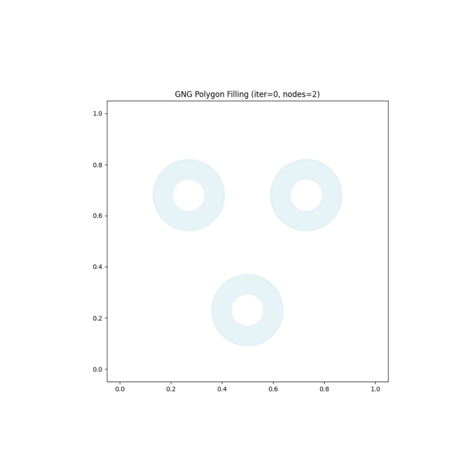
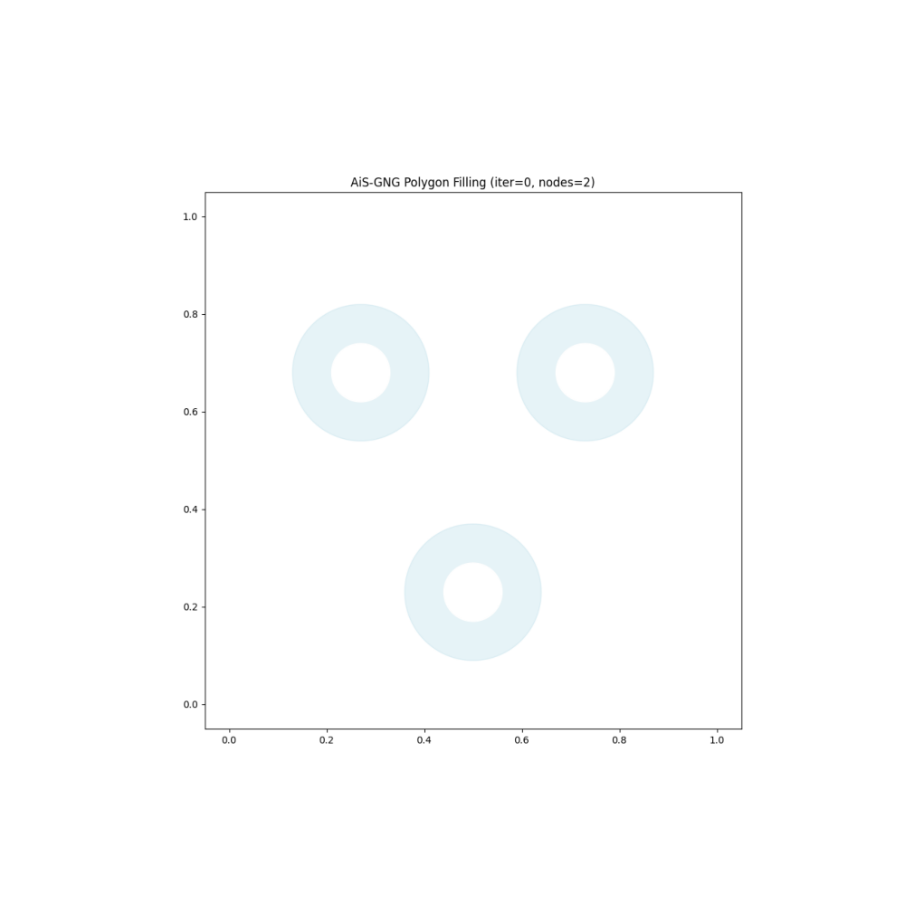
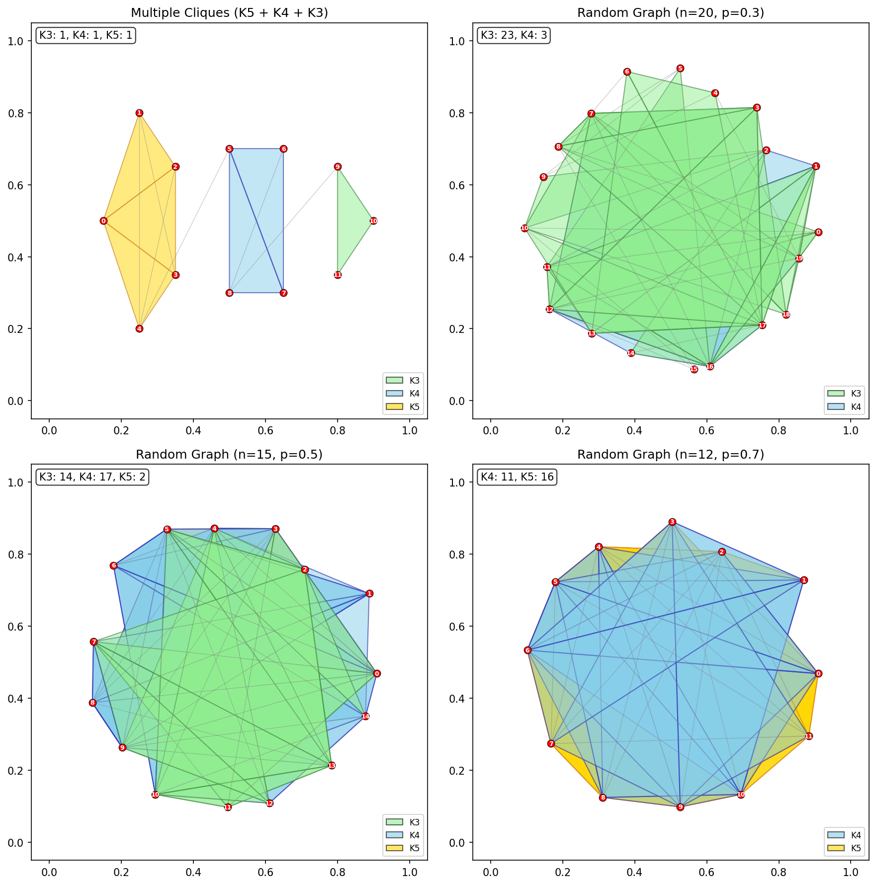
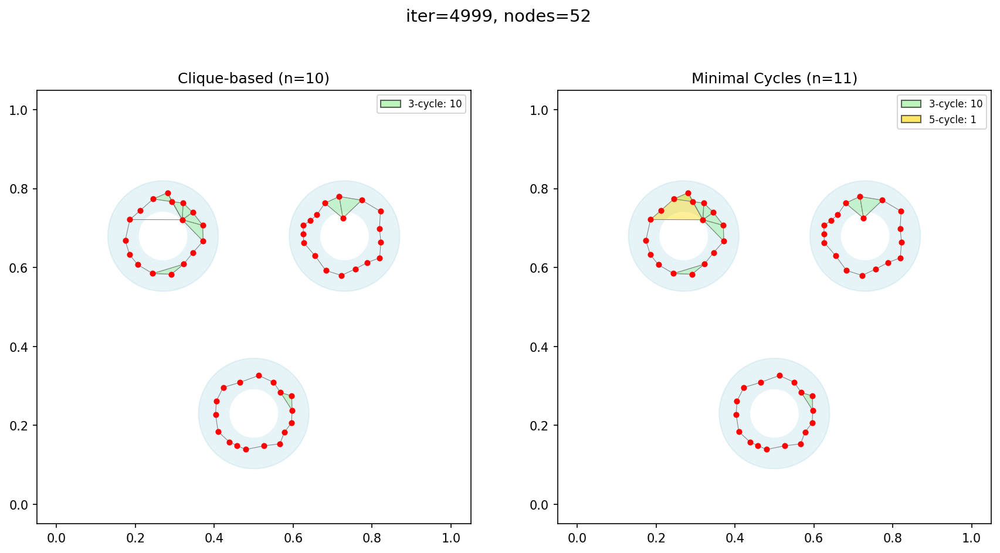
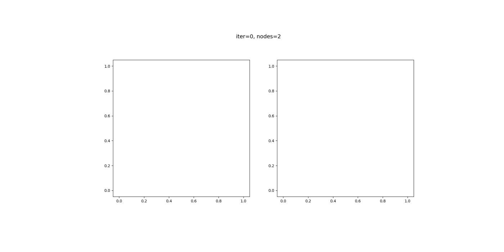
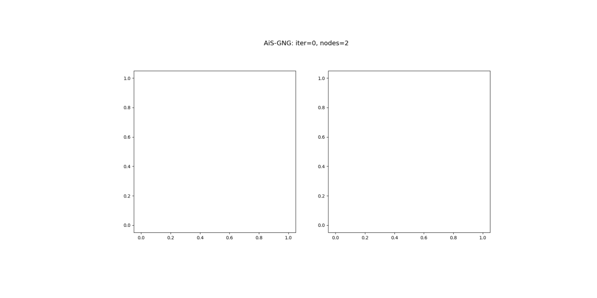
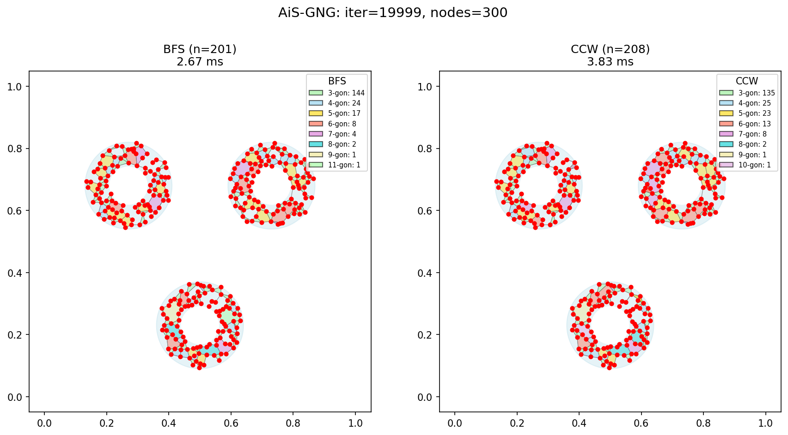

# 多角形塗りつぶし実験

GNGで検出されるクリーク構造の可視化実験。極大クリーク検出と三角形分割による多角形塗りつぶしを実装。

## アルゴリズム

### 極大クリーク検出: Bron-Kerbosch法

**極大クリーク**: これ以上頂点を追加できないクリーク（完全部分グラフ）

```
K4 = {A,B,C,D} が存在する場合:
  ✓ K4 が検出される（極大）
  ✗ 内部のK3は検出されない（K4に拡張可能なので極大ではない）
```

#### 基本版
```python
def bron_kerbosch(R, P, X):
    if P と X が両方空:
        R は極大クリーク → 出力

    for v in P:
        bron_kerbosch(R ∪ {v}, P ∩ N(v), X ∩ N(v))
        P = P \ {v}
        X = X ∪ {v}
```

#### Pivot最適化版
```python
def bron_kerbosch_pivot(R, P, X):
    if P と X が両方空:
        R は極大クリーク → 出力

    # Pivot選択（P∪Xで最も隣接数が多い頂点）
    pivot = argmax_{v ∈ P∪X} |N(v) ∩ P|

    # Pivotの非隣接頂点のみ探索（枝刈り）
    for v in P - N(pivot):
        bron_kerbosch_pivot(R ∪ {v}, P ∩ N(v), X ∩ N(v))
        ...
```

### 描画: 極大クリーク → 三角形分割

```
K4 → 2つの三角形に分割（Fan Triangulation）
K5 → 3つの三角形に分割
Kn → (n-2)つの三角形に分割
```

## 結果

### GNG トリプルリング（疎なグラフ）



K3（三角形）のみ検出。GNGは疎なグラフを生成するため、K4以上はほとんど出現しない。

### AiS-GNG トリプルリング（密なグラフ）



AiS-GNGはAdd-if-Silentルールによりノードを密に生成するため、K3に加えてK4、K5も検出される。

- 緑: K3（三角形）
- 青: K4（四面体）
- 黄: K5（五角形完全グラフ）

### 密なグラフでのクリーク可視化



左上から時計回りに:
1. **Multiple Cliques (K5+K4+K3)**: 既知構造（K5, K4, K3が各1個）
2. **Random (p=0.3)**: K3とK4が混在
3. **Random (p=0.7)**: K4〜K6が多数検出
4. **Random (p=0.5)**: K3〜K5が検出

### アルゴリズム比較

#### GNGグラフ（疎なグラフ）での結果

| 項目 | 基本版 | Pivot版 |
|------|--------|---------|
| 検出数 | 11個 (K3のみ) | 11個 (K3のみ) |
| 実行時間 | 0.134 ms | 0.203 ms |
| 速度比 | 1.0x | **0.66x (遅い)** |

**考察**: 疎なグラフでは、Pivot選択のオーバーヘッドが枝刈りの効果を上回る。

#### 密なグラフでの結果（test_dense_graph.py）

| テスト | ノード数 | エッジ密度 | 検出クリーク | 基本版 | Pivot版 | 速度向上 |
|--------|---------|-----------|-------------|--------|---------|---------|
| 複数クリーク | 12 | - | K3:1, K4:1, K5:1 | 0.038ms | 0.031ms | **1.21x** |
| ランダム(p=0.3) | 30 | 30% | K3:63, K4:12 | 0.385ms | 0.406ms | 0.95x |
| ランダム(p=0.5) | 30 | 50% | K3:15, K4:122, K5:48, K6:7 | 1.615ms | 1.067ms | **1.51x** |
| ランダム(p=0.7) | 25 | 70% | K5:26, K6:96, K7:61, K8:14 | 6.665ms | 1.485ms | **4.49x** |
| 完全グラフK10 | 10 | 100% | K10:1 | 1.054ms | 0.046ms | **22.67x** |

**結論**: グラフが密になるほどPivot最適化の効果が顕著。

#### 推奨

| グラフの密度 | 基本版 | Pivot版 | 推奨 |
|-------------|--------|---------|------|
| 疎（GNG等） | 高速 | オーバーヘッド | 基本版 |
| 中程度(p≈0.3) | 同等 | 同等 | どちらでも |
| 密(p≧0.5) | 遅い | **高速** | Pivot版 |
| 完全グラフ | 非常に遅い | **非常に高速** | Pivot版 |

## 使い方

```bash
cd experiments/polygon_filling

# GNGトリプルリングテスト（GIF生成）
python test_gng_triple_ring.py

# AiS-GNGトリプルリングテスト（密なグラフ、GIF生成）
python test_aisgng_triple_ring.py

# 密なグラフでのアルゴリズム比較（コンソール出力）
python test_dense_graph.py

# 密なグラフの可視化（PNG生成）
python test_dense_graph_visual.py
```

### 出力ファイル

```
samples/
├── gng_triple_ring_final.png       # GNG最終結果
├── gng_triple_ring_growth.gif      # GNG成長アニメーション
├── aisgng_triple_ring_final.png    # AiS-GNG最終結果
├── aisgng_triple_ring_growth.gif   # AiS-GNG成長アニメーション
├── dense_graph_cliques.png         # 密グラフのクリーク可視化
└── algorithm_comparison.txt        # アルゴリズム比較結果
```

### カスタマイズ

```python
from polygon_utils import bron_kerbosch_pivot, decompose_to_triangles

# 極大クリーク検出
result = bron_kerbosch_pivot(edges_per_node, active_node_ids, min_size=3)

# サイズ別カウント
print(result.count_by_size())  # {3: 11, 4: 2, ...}

# 三角形に分割
triangles = decompose_to_triangles(result.cliques)
```

## ファイル構成

```
experiments/polygon_filling/
├── README.md                       # このファイル
├── polygon_utils.py                # クリーク検出・サイクル検出ユーティリティ
├── test_gng_triple_ring.py         # GNGテスト（疎なグラフ）
├── test_aisgng_triple_ring.py      # AiS-GNGテスト（密なグラフ）
├── test_dense_graph.py             # アルゴリズム比較（コンソール）
├── test_dense_graph_visual.py      # 密グラフの可視化
├── test_triangle_comparison.py     # 三角形検出方法の比較
├── test_minimal_cycles.py          # 最小サイクル検出テスト（GNG）
├── test_aisgng_minimal_cycles.py   # 最小サイクル検出テスト（AiS-GNG）
├── test_bfs_vs_ccw.py              # BFS vs CCW アルゴリズム比較
└── samples/                        # 出力結果
    ├── gng_triple_ring_*.png/gif
    ├── aisgng_triple_ring_*.png/gif
    ├── dense_graph_cliques.png
    ├── triangle_comparison_*.png/gif
    ├── minimal_cycles_*.png/gif
    └── algorithm_comparison.txt
```

## 最小サイクル検出

### 問題: 極大クリーク方式の限界

極大クリーク方式では、頂点間に全てのエッジが存在する「完全部分グラフ」のみを検出する。
しかし、GNGのようなグラフでは、エッジで囲まれているが対角線がない四角形や五角形が存在する。

```
極大クリーク方式で検出できない例:

    A---B
    |   |     ← 四角形だが、対角線AC, BDがないためK4ではない
    D---C

    A---B
   / \ / \    ← 五角形だが、全対角線がないためK5ではない
  E   X   C
   \ / \ /
    D---E
```

### 解決策: 最小サイクル検出

最小サイクル検出は、各エッジについてそのエッジを含む最小サイクルを探索する。
これにより、エッジで囲まれた全ての領域（面）を検出できる。

### 比較結果



| 方式 | 検出対象 | 検出数（例） |
|------|---------|-------------|
| 極大クリーク | 完全部分グラフ（K3, K4, K5...） | 10個（三角形のみ） |
| 最小サイクル | エッジで囲まれた全領域 | 11個（三角形10 + 五角形1） |

### 使い方

```python
from experiments.polygon_filling.polygon_utils import detect_minimal_cycles

# 最小サイクル検出
result = detect_minimal_cycles(nodes, edges_per_node, max_cycle_size=8)

# サイズ別カウント
print(result.count_by_size())  # {3: 10, 5: 1, ...}

# 各サイクルの頂点リスト
for cycle in result.cycles:
    print(cycle)  # [0, 3, 7, 2, 1]
```

### GNGでの比較



左: 極大クリーク方式（三角形のみ）
右: 最小サイクル方式（全サイズ、色分け）

### AiS-GNGでの比較（300ノード）

AiS-GNGは密なグラフを生成するため、より多様な多角形が検出される。


| 方式 | 検出総数 | 計算時間 |
|------|----------|---------|
| 極大クリーク | 142個（K3:141, K4:1） | 2.62 ms |
| 最小サイクル（CCW版） | 208個（3〜10角形） | 5.96 ms |

**最小サイクル方式の検出内訳（AiS-GNG 300ノード）:**

| サイズ | 検出数 |
|--------|--------|
| 3角形 | 135個 |
| 4角形 | 25個 |
| 5角形 | 23個 |
| 6角形 | 13個 |
| 7角形 | 8個 |
| 8角形 | 2個 |
| 9角形 | 1個 |
| 10角形 | 1個 |



### 最小サイクル検出アルゴリズム比較: BFS版 vs CCW版

2つの最小サイクル検出アルゴリズムを実装:

#### BFS版（簡易版）
- 各エッジについてBFSで最小サイクルを探索
- **高速**だが、各エッジから1つのサイクルしか検出しない
- 同じエッジを共有する複数の面がある場合、検出漏れが発生

#### CCW版（反時計回り探索）
- 平面グラフの面検出アルゴリズム
- 各有向エッジ(u,v)は正確に1つの面に属する性質を利用
- **全ての面を完全に検出**

```
CCW探索の仕組み:
1. 各ノードの隣接ノードを角度順にソート
2. 有向エッジ(u→v)から開始
3. vで反時計回りに次のエッジを選択
4. 開始点に戻るまで辿る → 1つの面を検出
```

#### AiS-GNG 300ノードでの比較



| アルゴリズム | 検出総数 | 計算時間 | 特徴 |
|-------------|----------|---------|------|
| BFS版 | 201個 | 3.49 ms | 高速だが検出漏れあり |
| CCW版 | **208個** | 4.81 ms | 全面を完全検出 |

**検出内訳の比較:**

| サイズ | BFS版 | CCW版 | 差分 |
|--------|-------|-------|------|
| 3角形 | 144 | 135 | -9 |
| 4角形 | 24 | 25 | +1 |
| 5角形 | 17 | 23 | +6 |
| 6角形 | 8 | 13 | +5 |
| 7角形 | 4 | 8 | +4 |
| 8角形 | 2 | 2 | 0 |
| 9角形 | 1 | 1 | 0 |
| 10/11角形 | 1 | 1 | 0 |


**考察:**
- CCW版は5角形以上の面をより多く検出
- 3角形がBFS版より少ないのは、一部のK4がBFS版では三角形として誤検出されていたため
- CCW版は計算時間が約1.5倍だが、正確性を重視する場合に推奨

#### 使い分け

```python
from experiments.polygon_filling.polygon_utils import detect_minimal_cycles

# CCW版（デフォルト、正確）
result = detect_minimal_cycles(nodes, edges_per_node)

# BFS版（高速、一部検出漏れあり）
result = detect_minimal_cycles(nodes, edges_per_node, use_simple=True)
```

### 検出閾値

`max_cycle_size` パラメータで検出する最大サイクルサイズを制御できる。

```python
# 8角形まで検出（デフォルト）
result = detect_minimal_cycles(nodes, edges_per_node, max_cycle_size=8)

# 12角形まで検出
result = detect_minimal_cycles(nodes, edges_per_node, max_cycle_size=12)
```

- 大きな値にすると計算時間が増加する
- 平面グラフでは通常、外周以外の面は小さいサイクルで構成される

### 色分け

- 緑: 3-サイクル（三角形）
- 青: 4-サイクル（四角形）
- 金: 5-サイクル
- 赤: 6-サイクル
- 紫: 7-サイクル
- シアン: 8-サイクル
- カーキ: 9-サイクル
- プラム: 10-サイクル

## 参考文献

- Bron, C., & Kerbosch, J. (1973). "Algorithm 457: finding all cliques of an undirected graph"
- Tomita, E., Tanaka, A., & Takahashi, H. (2006). "The worst-case time complexity for generating all maximal cliques"
